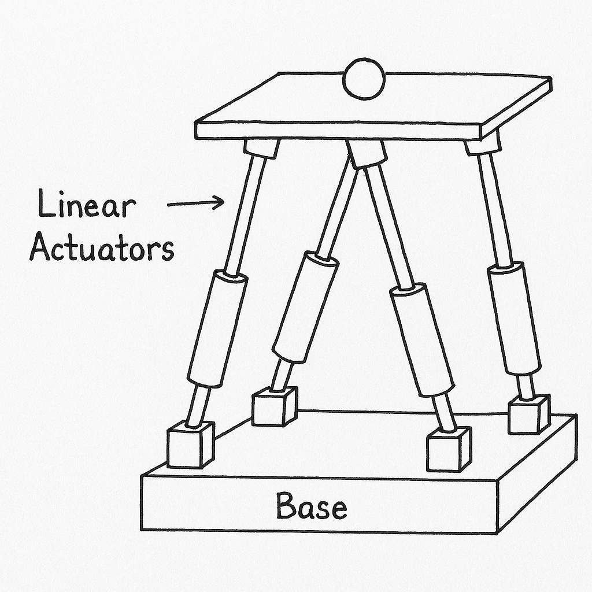

## 1. Mechanical Design (Unlimited Actuators – 6DOF Platform)

If I had no limits on actuators or motors, I would go for a full 6DOF Stewart Platform for balancing the ball. This means the platform will have six linear actuators, each connecting the base to the platform using universal joints on both ends. These actuators can extend and contract to tilt the platform in any direction and also move it up/down or rotate it slightly.

## 2. Why 6DOF is Better

With 6 degrees of freedom, the platform becomes very flexible. It can tilt in both X and Y directions to balance the ball, and also adjust its height or rotate if needed for correction. This gives us more stability and accuracy, and the ball stays on the platform even during fast changes. The system responds better and can make smoother adjustments because we have more control in all directions.

## 3. ROUGH SKETCH

## 4. Pros and Cons
Pros:
* Very stable and smooth movement
* Full control in all directions
* Ball can be balanced more precisely
* Good performance in real-time systems
Cons:
* Expensive because 6 actuators are used
* More wiring and mechanical parts → more complex
* Higher chance of failure if any actuator stops working
* Needs good programming and calibration

## PART B
## 1. Non-Vision Sensing – Method 1: Pressure Sensor Grid
Here, we use a flat pressure sensor sheet or matrix under the platform. As the ball rolls, it presses on the sheet and we can find its position by checking where the pressure is highest.
Sensors Used: Force-sensitive resistor (FSR) sheet or Velostat sheet
How it works: When the ball rolls, it presses on the sheet. The microcontroller reads values and finds the ball's 2D position.
Pros: Simple design, fast response, no camera needed
Cons: Not very accurate, can miss light balls, resolution depends on grid density

## 2. Non-Vision Sensing – Method 2: IR or Capacitive Grid
This method uses an infrared grid (or capacitive sensors) above or below the platform. When the ball blocks or affects the IR beam or capacitance, the system can detect its position.
Sensors Used: Infrared emitter-detector pairs or capacitive touch sensors
How it works: Ball interrupts the signal, and system detects which sensor line got affected. That tells us the ball’s position.
Pros: Non-contact, good accuracy if grid is dense, fast
Cons: Sensitive to environment, harder to implement than pressure grid, needs calibration
